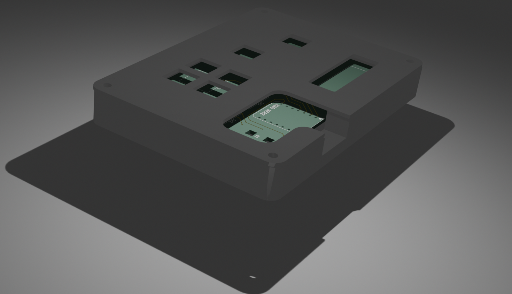
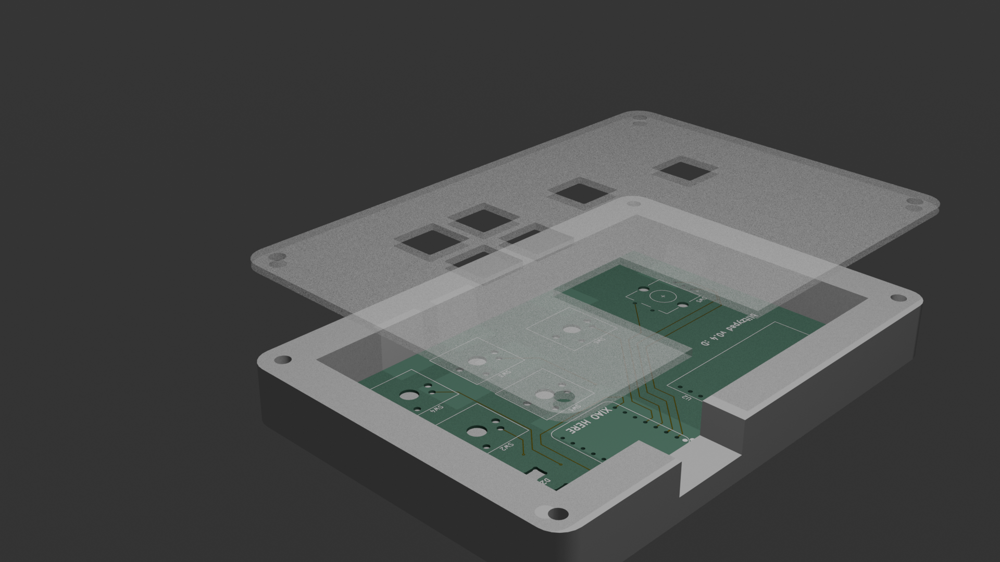
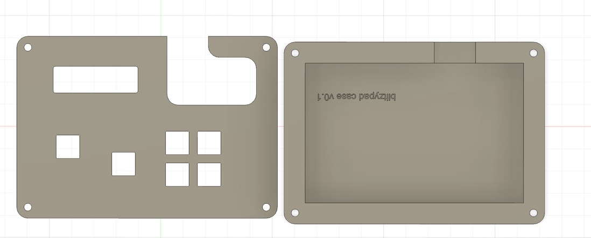
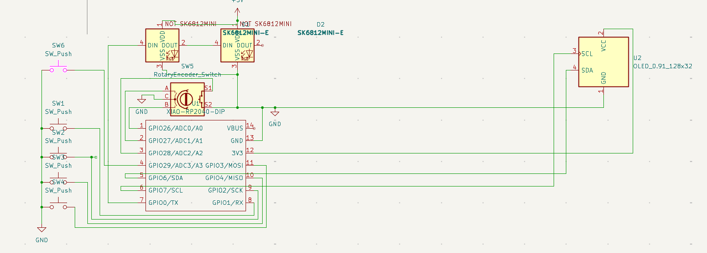
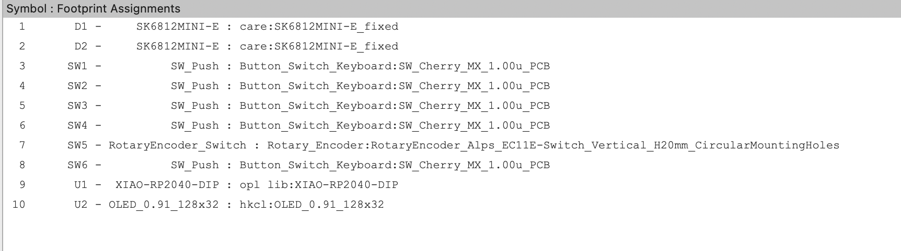

# blitzypad

My starter hackpad project for Blueprint! Has four keys in a grid, an extra key, a rotary encoder, and a 128x32 OLED screen.

I don't have a screenshot of my overall project because it doesn't exist physically yet.

I plan to use this for all sorts of things! General use, sure. Probably also music production with that cool rotary encoder (time scrub / volume control). Or maybe even something like gaming or video editing! That's the beauty of circuitpython. It's really easy and you don't have to reflash every time. I may even try to have some dynamic things on the OLED screen down the line... After all, rp2040 can act as an arbitrary usb device! I've [done](https://github.com/JBlitzar/pd-usb-uvc) [some](https://github.com/JBlitzar/picoducky) [projects](https://github.com/JBlitzar/pd-quad-draw) with those as a part of picoducky ysws. This is really cool because we've got some additional hardware IO (namely the keys, rotary encoder, leds, and screen.)

## Case

_made in Fusion 360_

I have access to a laser cutter + 3d printer, so I won't need these to be shipped.

## Schematic

_made in Kicad_

### PCB:

> I had some fun with the graphics, haha

### Schematic:

> (sorry it's a bit messy)

### Footprints:

## BOM:

- 5 Cherry MX Switches
- 5 Keycaps
- 2 SK6812MINI-E LEDs
- 1 0.91" SSD1306 128x32 I2C OLED Display
- 1 Alps rotary encoder, EC12E with switch, vertical shaft.
- 1 XIAO RP2040
- 1 Case
- 4 bolts to hold the case together, I guess?
